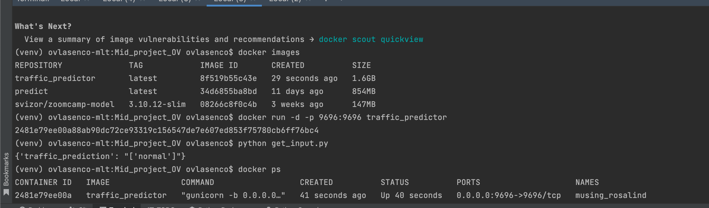
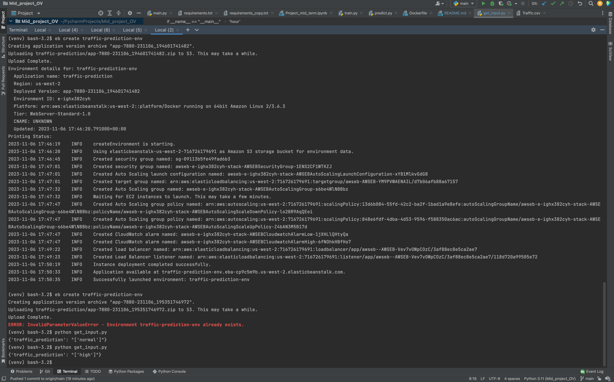
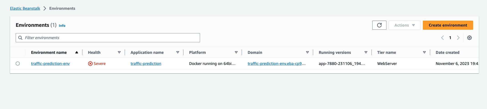

# mid_term_project_mlzoomcamp
## Summary
This project will include the following:
1. Problem Description
2. EDA and Dataset preparation
3. Model Training and tuning
4. Evaluating models score and train the final model
5. Exporting notebook to script
6. Model deployment and test with Flask
7. Dependency and enviroment management
8. Containerization
9. AWS deploy 
The idea is to apply everything learned so far.

## Problem Description
This is a midterm project where I was trying to use different models (logistic regrssion, decision tree and random forest) for multi-class prediction of the traffic load base don the hour, minute and day of the week. 

Here is a dataset I used: https://www.kaggle.com/datasets/hasibullahaman/traffic-prediction-dataset
Dataset has some features as time, day of the week and counts of the car, bus, bike traffic. After analysis of the traffic counts it appears that there is a direct correlation between Traffic Situation and counts of the cars, giving my model 99% accuracy, thus for my purposes I have excluded car/bus/bike counts data and did some Feature Engineering, to make predictions not so biased.

The goal of the model is to predict the traffic situaiton based on the time and week day. 

## EDA and Data Preparation
For preparing data to analysis I did the followinf:
1. Transformed columns into the lowercase and replaced spaces with underscored
2. Split the value of "time" column in format "10:45:00 PM" to hour and minute in number format 22 and 45
3. Added features is_evening, is_morning, is_day, is_night, weekend with boolean values for further cassification
4. Left the day_of_the_week value unchanged categorical to fit in DictVectorizer
5. Mapped categorical values of traffic_situation into numbers
6. Checked feature correlation for numeric values
7. Analyzed how balanced is dataset for each state of traffic situation (turned out to be unblanced, thus final model needed to be balnced with parameter)

Once all the analysis and data pre was done I split the dataset into full_train and test, and then split full_train into train and validation datasets.
Created y data sets with values of traffic_situation and removed traffic_situation from the dataset

## Model Training and tuning
In order to find the best model I used:
1. LogisticRegression
2. RandomForestClassifier
3. DecisionTreeClassifier

### Linear Regression Classifier 
I have tried to find the best regularization parameter which appeared not to have much impact and validated the score of it

### Decision Tree
I tried to find the best values of depth and min_samples_leaf parameters to train a model to find the best aaccuracy 

### Randon Forest 
For Random forest I have analyzed model behavior and tried to find best parameters for:
- n_estimators
- max_depth
And based on my results derived the most optimal ones using model accuracy

## Evaluating models score and train the final model
Based on the results of each model and their accuracy I found that the optimal model giving the highest accuracy would be RandomForestClassifier which was used to train the final model.
For estimating accuracy I used method from  sklearn.metrics import accuracy_score.
Final model was trained on the full_train dataset and validated on test dataset

## Exporting notebook to a python file
The Jupiter Notebook was exported in Python. Built train.py script. train.py script read the dataset csv file loaded on the project github, saved results with Dictvectorizer into a model.bin.

##  Model deployment and test with Flask
Using pickle I have imported the model and DictVectorized into the predict.py file which is making the prediction and returning the result converted back into the Low, Nornal, High, Heavy values 
Predict is a POST service accepting input values in json format from get_input.py (in json format as well) and returning the prediciton for traffic situation

## Dependency and enviroment management
In this part I prepare the pipenv virtual environment with all the necessary package to use our model

This command installs all the dependencied needed (including flask, pandas, gunicord, etc)
pip install -r requirements.txt

Service was launched with a command on a local server:
 python predict.py
With copied local server ip the get_input.py was updated 

## Containerization
I used python:3.11.5-slim a light version with python 3.11 and prepared a Dockerfile to build the image with all the necessary for the service:

FROM python:3.11.5-slim

COPY ["requirements.txt", "./"]
RUN pip install -r requirements.txt

COPY ["model.bin", "./"]

COPY ["predict.py", "./"]
EXPOSE 9696
ENTRYPOINT ["gunicorn", "-b", "0.0.0.0:9696", "predict:app"]

To summarize, the script downloads the clean imange, install the packages listed in Pipfiles, prepare the pip virtual environment, copy the model model.bin and the service script, expose and run the service using gunicorn

In order to run Docket you need to:
1. Open Docker Desktop
2. Run commands:
docker build . -t "traffic_predictor"
docker run -p 8080:9696 predict:latest

Then once Docker is running you can run the script for sending input data and see the traffic_prediction service response by running the command:
 python get_input.py

## Deployemnt 
I used AWS Elastic Beanstalk for cloud deploy 

The following steps for configuration:
pipenv install awsebcli --dev

 pipenv shell
 
 eb init -p docker  -r us-west-2 traffic-prediction (change teh region for yours)

Create environment on AWS to deploy model
eb create traffic-prediction-env

Make sure get_input.py has host updated to the right link
Run the command to have a prediction:
python get_input.py

Screenshot of a model running on the Cloud and returning different predictions:

